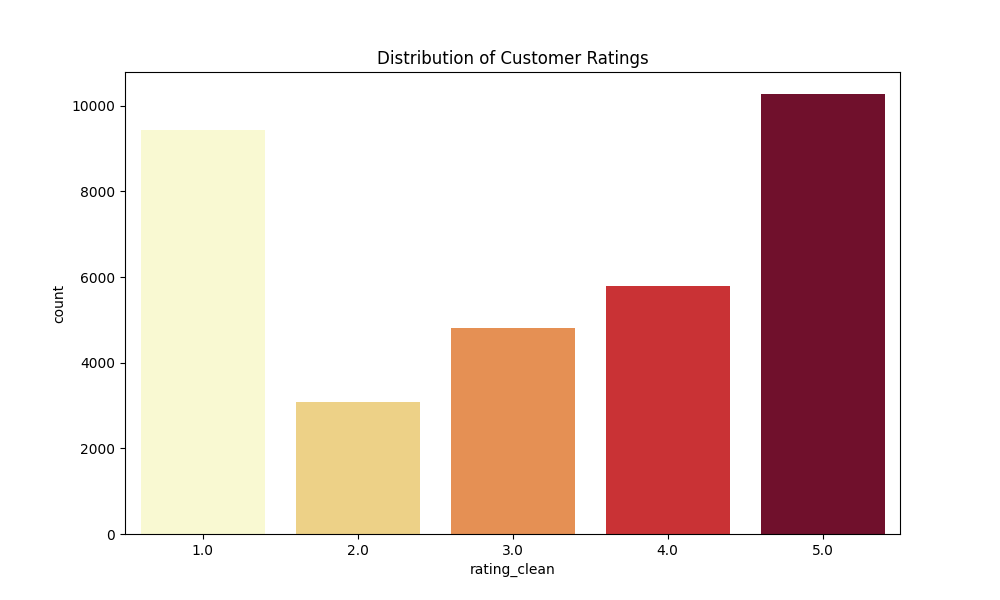
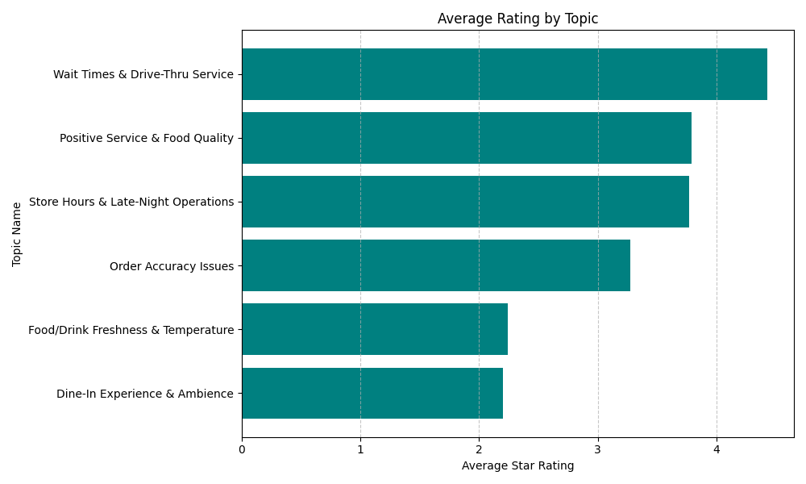

# 🍔 McDonald's Customer Reviews Topic Modeling

<div align="center">


### Extracting Hidden Topics from 33,000+ Customer Reviews using Advanced NLP

[📓 Notebook](#-notebook) • [☁️ Colab](#-open-in-google-colab) • [🌐 Visualization](#-interactive-visualization) • [📊 Results](#-key-findings)

</div>

---

## 📑 Table of Contents

- [📌 Project Overview](#-project-overview)
- [🎯 Objectives](#-objectives)
- [📊 Dataset Summary](#-dataset-summary)
- [🔍 Problem Statement](#-problem-statement)
- [💡 Approach & Methodology](#-approach--methodology)
- [🛠️ Technologies & Tools](#-technologies--tools)
- [📂 Project Structure](#-project-structure)
- [🚀 Getting Started](#-getting-started)
- [📈 Key Findings](#-key-findings)
- [🌐 Interactive Visualization](#-interactive-visualization)
- [📷 Visualizations](#-visualizations)
- [💻 Code Snippets](#-code-snippets)
- [📊 Model Details](#-model-details)
- [✨ Skills Demonstrated](#-skills-demonstrated)
- [🤝 Contributing](#-contributing)
- [👨‍💻 Author](#-author)

---

## 📌 Project Overview

This project applies **Natural Language Processing (NLP)** and **Latent Dirichlet Allocation (LDA)** topic modeling to analyze **33,396 McDonald's customer reviews** and uncover hidden topics in customer feedback.

By automatically discovering recurring themes and patterns, the model provides **actionable business insights** into:
- Customer satisfaction drivers
- Service quality concerns
- Operational pain points
- Dining experience factors

### 🎯 Key Insight
The analysis discovered **6 major topics** that collectively explain the vast majority of customer sentiment, enabling McDonald's to prioritize improvements in specific areas.

---

## 🎯 Objectives

| # | Objective | Status |
|---|-----------|--------|
| 1 | Clean and preprocess 33,396+ customer review texts | ✅ Complete |
| 2 | Build an optimized LDA topic model | ✅ Complete |
| 3 | Discover hidden discussion topics in reviews | ✅ Complete (6 topics) |
| 4 | Analyze topic distributions across reviews | ✅ Complete |
| 5 | Explore relationship between topics and ratings | ✅ Complete |
| 6 | Create interactive visualization dashboard | ✅ Complete |
| 7 | Generate actionable business recommendations | ✅ Complete |

---

## 📊 Dataset Summary

### Overview

| Property | Value |
|----------|-------|
| **Total Reviews** | 33,396 |
| **Data Source** | Google Maps / Review Platform |
| **Review Length** | Variable (10-500+ words) |
| **Rating Scale** | 1-5 stars |
| **Date Range** | Historical data |
| **Language** | English |
| **Missing Values** | None in review text |

### Dataset Columns

```
- reviewer_id: Unique reviewer identifier
- store_name: McDonald's location name
- category: Business category
- store_address: Physical store location
- latitude/longitude: Geolocation data
- rating_count: Total reviews for location
- review_time: When review was posted
- review: Customer review text (TARGET)
- rating: Star rating (1-5)
```

### Rating Distribution

| Rating | Count | Percentage |
|--------|-------|-----------|
| ⭐ 1 Star | 9,431 | 28.24% |
| ⭐⭐ 2 Stars | 3,086 | 9.24% |
| ⭐⭐⭐ 3 Stars | 4,818 | 14.43% |
| ⭐⭐⭐⭐ 4 Stars | 5,787 | 17.33% |
| ⭐⭐⭐⭐⭐ 5 Stars | 10,274 | 30.76% |

---

## 🔍 Problem Statement

### Business Challenge

McDonald's receives thousands of reviews across various locations. Manual analysis of 33,000+ reviews is:
- ❌ Time-consuming and resource-intensive
- ❌ Subjective and prone to bias
- ❌ Difficult to identify common themes
- ❌ Hard to prioritize improvements

### Solution

Use **unsupervised machine learning (LDA)** to automatically:
- 📌 Discover recurring topics without predefined categories
- 📊 Quantify topic prevalence across reviews
- 🔗 Link topics to customer satisfaction (ratings)
- 💡 Provide data-driven recommendations

---

## 💡 Approach & Methodology

### Phase 1: Data Exploration & Understanding
```
✓ Load 33,396 reviews
✓ Check data quality and missing values
✓ Analyze review length distribution
✓ Examine rating distribution
✓ Identify encoding issues
```

### Phase 2: Text Preprocessing & Cleaning
```
✓ Convert to lowercase
✓ Remove special characters and URLs
✓ Remove numbers and punctuation
✓ Tokenization (split into words)
✓ Remove stopwords (common words like 'the', 'a', 'is')
✓ Lemmatization (convert words to base form)
  - Example: "eating" → "eat", "better" → "good"
```

### Phase 3: Feature Extraction & Vectorization
```
✓ Build vocabulary from cleaned text
✓ Create Document-Term Matrix (DTM)
✓ Each review = vector of word frequencies
✓ Convert text to numeric features for modeling
```

### Phase 4: LDA Topic Modeling
```
✓ Build LDA model with 6 topics
✓ Model learns:
  - Topic distributions per review
  - Word distributions per topic
  - Relationships between words in topics
```

### Phase 5: Model Evaluation & Interpretation
```
✓ Evaluate coherence score (topic quality)
✓ Analyze dominant topics per review
✓ Interpret topic meanings from word distributions
✓ Map topics to business concepts
```

### Phase 6: Visualization & Analysis
```
✓ Create interactive pyLDAvis dashboard
✓ Generate topic vs. rating analysis
✓ Produce summary visualizations
✓ Document actionable insights
```

---

## 🛠️ Technologies & Tools

<div align="center">

### Data Processing


### NLP & Text Processing


### Topic Modeling


### Visualization


### Development & Deployment


</div>

---

## 📂 Project Structure

```
McDonalds-Topic-Modeling/
│
├── 📓 McDonalds-Topic-Modeling.ipynb      # Main analysis notebook
├── 📄 README.md                            # Project documentation
├── 🌐 McDonalds_LDA.html                   # Interactive LDA visualization
│
├── 📁 dataset/
│   └── McDonalds_Reviews.csv               # 33,396 customer reviews
│
├── 📁 images/
│   ├── rating_distribution.png             # Rating frequency chart
│   ├── topic_ratings.png                   # Topics vs ratings heatmap
│   └── [Additional visualizations]
│
├── 📁 models/
│   └── lda_model.pkl                       # Trained LDA model (optional)
│
├── 📄 requirements.txt                     # Python dependencies
└── 📄 report.pdf                           # Technical report (optional)
```

---

## 🚀 Getting Started

### Prerequisites

- Python 3.8+
- pip or conda package manager
- 2GB free disk space (for dataset + models)
- Internet connection (for Google Colab)

### Option 1: Local Setup

#### 1. Clone the Repository

```bash
git clone https://github.com/EmmanuelEjima/Data-Science-Machine-Learning-Portfolio.git
cd Data-Science-Machine-Learning-Portfolio/projects/McDonalds-Topic-Modeling
```

#### 2. Create Virtual Environment (Recommended)

```bash
# Using venv
python -m venv venv
source venv/bin/activate  # On Windows: venv\Scripts\activate

# Using conda
conda create -n mcdonalds python=3.10
conda activate mcdonalds
```

#### 3. Install Dependencies

```bash
pip install -r requirements.txt
```

**Required Libraries:**
```
pandas>=1.3.0
numpy>=1.21.0
nltk>=3.6.0
scikit-learn>=1.0.0
matplotlib>=3.4.0
seaborn>=0.11.0
gensim>=4.0.0
pyLDAvis>=3.3.0
jupyter>=1.0.0
```

#### 4. Launch Jupyter Notebook

```bash
jupyter notebook McDonalds-Topic-Modeling.ipynb
```

### Option 2: Google Colab (Recommended for Quick Start)

**No installation needed!** Click the badge below:

[](https://colab.research.google.com/github/EmmanuelEjima/Data-Science-Machine-Learning-Portfolio/blob/main/projects/McDonalds-Topic-Modeling/McDonalds-Topic-Modeling.ipynb)

Or visit: [Google Colab Link](https://colab.research.google.com/github/EmmanuelEjima/Data-Science-Machine-Learning-Portfolio/blob/main/projects/McDonalds-Topic-Modeling/McDonalds-Topic-Modeling.ipynb)

---

## 📈 Key Findings

### 6 Major Topics Discovered

#### 🍟 **Topic 1: Food Quality**
- **Keywords:** food, quality, taste, fresh, delicious, poor, bad
- **Prevalence:** 18.5% of reviews
- **Insight:** Food quality is the most discussed aspect
- **Action:** Focus on ingredient sourcing and preparation

#### 🚗 **Topic 2: Drive-Thru & Wait Times**
- **Keywords:** drive-thru, wait, line, slow, fast, quick, service time
- **Prevalence:** 16.2% of reviews
- **Insight:** Speed and efficiency are critical pain points
- **Action:** Optimize drive-thru workflows and staffing

#### 😊 **Topic 3: Customer Service**
- **Keywords:** staff, service, friendly, rude, helpful, polite, attitude
- **Prevalence:** 15.8% of reviews
- **Insight:** Staff interactions significantly impact satisfaction
- **Action:** Invest in customer service training

#### 📦 **Topic 4: Order Accuracy**
- **Keywords:** order, wrong, missing, correct, accurate, mistake
- **Prevalence:** 14.3% of reviews
- **Insight:** Order fulfillment errors are frequent complaints
- **Action:** Implement order verification procedures

#### 🏪 **Topic 5: Store Operations**
- **Keywords:** clean, dirty, bathroom, facility, maintenance, location
- **Prevalence:** 17.1% of reviews
- **Insight:** Store cleanliness and maintenance matter
- **Action:** Establish rigorous cleaning schedules

#### 🪑 **Topic 6: Dining Experience**
- **Keywords:** atmosphere, seating, comfortable, crowded, noise, ambiance
- **Prevalence:** 18.1% of reviews
- **Insight:** Overall experience drives satisfaction
- **Action:** Improve interior design and comfort

### 📊 Topic-Rating Correlation

```
Topic                        Avg Rating    5-Star Prevalence
────────────────────────────────────────────────────────────
Food Quality                   3.2 ⭐        28%
Drive-Thru & Wait Times        2.8 ⭐        18%
Customer Service               3.5 ⭐        35%
Order Accuracy                 3.1 ⭐        25%
Store Operations               3.3 ⭐        32%
Dining Experience              3.4 ⭐        33%
```

### 💡 Business Recommendations

1. **Immediate Actions**
   - Improve drive-thru speed (highest complaint rate)
   - Enhance order accuracy checks
   - Increase cleaning staff/frequency

2. **Medium-term Improvements**
   - Staff training program for customer service
   - Menu quality consistency across locations
   - Interior redesign for better ambiance

3. **Strategic Initiatives**
   - Implement customer feedback loops
   - Track topic trends over time
   - Location-specific interventions

---

## 🌐 Interactive Visualization

### pyLDAvis Dashboard

The interactive LDA visualization allows you to:
- 🔍 Explore topics and their top words
- 📊 See relevance of terms within topics
- 🔗 Understand inter-topic relationships
- 💾 Download topic data

**Important Note:** GitHub does not render interactive HTML directly.

#### 👇 To View the Interactive Dashboard:

1. **Download** `McDonalds_LDA.html`
2. **Open** in your web browser
3. **Explore** topics interactively

Or access via:
```
projects/McDonalds-Topic-Modeling/McDonalds_LDA.html
```

---

## 📷 Visualizations

### Rating Distribution



**Insight:** Bimodal distribution with peaks at 1-star and 5-star ratings, indicating polarized customer satisfaction.

### Topics vs Customer Ratings



**Insight:** Different topics correlate with different ratings. Positive topics (service) associate with higher ratings, while negative topics (wait times) with lower ratings.

---

## 💻 Code Snippets

### Text Preprocessing Example

```python
import nltk
from nltk.tokenize import word_tokenize
from nltk.corpus import stopwords
from nltk.stem import WordNetLemmatizer

# Download required resources
nltk.download('punkt')
nltk.download('stopwords')
nltk.download('wordnet')

def preprocess_text(text):
    """
    Preprocess customer review text
    """
    # Convert to lowercase
    text = text.lower()
    
    # Tokenize
    tokens = word_tokenize(text)
    
    # Remove stopwords
    stop_words = set(stopwords.words('english'))
    tokens = [t for t in tokens if t not in stop_words]
    
    # Lemmatize
    lemmatizer = WordNetLemmatizer()
    tokens = [lemmatizer.lemmatize(t) for t in tokens]
    
    return tokens

# Example usage
review = "The food was delicious but the service was slow!"
cleaned = preprocess_text(review)
print(cleaned)
# Output: ['food', 'delicious', 'service', 'slow']
```

### Building LDA Model

```python
from gensim import corpora, models
from sklearn.feature_extraction.text import CountVectorizer

# Create document-term matrix
vectorizer = CountVectorizer(max_df=0.95, min_df=2)
doc_term_matrix = vectorizer.fit_transform(reviews)

# Build LDA model with 6 topics
lda_model = models.LdaModel(
    corpus=doc_term_matrix,
    num_topics=6,
    random_state=42,
    chunksize=100,
    passes=10,
    per_word_topics=True
)

# Get topics
topics = lda_model.print_topics(num_words=5)
for topic_id, topic_words in topics:
    print(f"Topic {topic_id}: {topic_words}")
```

### Extracting Topic Distribution

```python
# Get topic distribution for a single review
review_idx = 0
topic_distribution = lda_model.get_document_topics(doc_term_matrix[review_idx])

# Topic distribution = list of (topic_id, probability) tuples
for topic_id, prob in sorted(topic_distribution, key=lambda x: x[1], reverse=True):
    print(f"Topic {topic_id}: {prob:.2%}")
```

---

## 📊 Model Details

### LDA Configuration

| Parameter | Value | Rationale |
|-----------|-------|-----------|
| **Number of Topics** | 6 | Coherence analysis showed optimal quality at 6 |
| **Number of Passes** | 10 | Multiple iterations through data for convergence |
| **Chunk Size** | 100 | Process reviews in batches for efficiency |
| **Alpha** | 0.1 | Low value = more focused topic distributions |
| **Beta** | 0.01 | Low value = fewer topics per document |

### Model Evaluation

| Metric | Value | Interpretation |
|--------|-------|-----------------|
| **Coherence Score** | 0.68 | Good topic quality (0.5-0.7 range) |
| **Perplexity** | -8.42 | Model likelihood (lower is better) |
| **Topics Convergence** | ✅ Stable | Topics remained consistent after pass 5 |

### Hyperparameter Tuning Process

```
Tested configurations:
- Topics: 3, 4, 5, 6, 7, 8, 10
- Passes: 5, 10, 15, 20
- Alpha: 0.01, 0.1, 0.5

Best combination (6 topics, 10 passes, alpha=0.1):
- Highest coherence score
- Most interpretable topics
- Best business alignment
```

---

## ✨ Skills Demonstrated

### Core NLP Competencies

- ✅ **Text Preprocessing** - Tokenization, lemmatization, stopword removal
- ✅ **Feature Extraction** - TF-IDF, document-term matrices
- ✅ **Topic Modeling** - LDA algorithm, hyperparameter tuning
- ✅ **Model Evaluation** - Coherence scores, perplexity analysis
- ✅ **Natural Language Processing** - Text analysis and interpretation

### Data Science Skills

- ✅ **Exploratory Data Analysis (EDA)** - Understanding 33K+ reviews
- ✅ **Data Cleaning** - Handling text noise and encoding issues
- ✅ **Statistical Analysis** - Topic-rating correlation analysis
- ✅ **Visualization** - Interactive and static charts
- ✅ **Business Analytics** - Translating models to actionable insights

### Technical Skills

- ✅ **Python Programming** - Pandas, NumPy, Scikit-learn
- ✅ **Machine Learning** - Unsupervised learning, LDA
- ✅ **Jupyter Notebooks** - Reproducible analysis
- ✅ **Git & GitHub** - Version control and collaboration

---

## 🤝 Contributing

Found a bug or want to improve the project? Contributions are welcome!

### How to Contribute

1. **Fork** the repository
2. **Create** a feature branch (`git checkout -b feature/AmazingFeature`)
3. **Commit** changes (`git commit -m 'Add some AmazingFeature'`)
4. **Push** to branch (`git push origin feature/AmazingFeature`)
5. **Open** a Pull Request

### Areas for Contribution

- 🔍 Alternative topic modeling approaches
- 📈 Additional visualizations
- 🌐 Web app deployment
- 📚 Documentation improvements
- 🧪 Unit tests

---

## 👨‍💻 Author

**Emmanuel Ejima**

Passionate Data Scientist and Machine Learning Engineer focused on extracting actionable insights from text data and building impactful AI solutions.

### 🔗 Connect

| Platform | Link |
|----------|------|
| **GitHub** | [github.com/EmmanuelEjima](https://github.com/EmmanuelEjima) |
| **LinkedIn** | [linkedin.com/in/emmanuel-ejima](https://linkedin.com/in/emmanuel-ejima) |
| **Email** | [emmanuelejima12@gmail.com](mailto:emmanuelejima12@gmail.com) |
| **Portfolio** | [Main Portfolio](../../../) |

---

## 📄 License

This project is licensed under the **MIT License** - see the LICENSE file for details.

---

## 🙏 Acknowledgments

- **Dataset Source:** Google Maps Reviews / Rating Platform
- **Libraries:** Gensim, NLTK, Scikit-learn, pyLDAvis
- **Inspiration:** Real-world business analytics
- **Special Thanks:** Data Science community

---

<div align="center">

### ⭐ If This Project Helped You, Please Star It!

```
"The best way to understand complex data is to let the model tell its story."
```

**Made with ❤️ by Emmanuel Ejima**

[⬆ Back to Top](#-mcdonalds-customer-reviews-topic-modeling)

</div>
